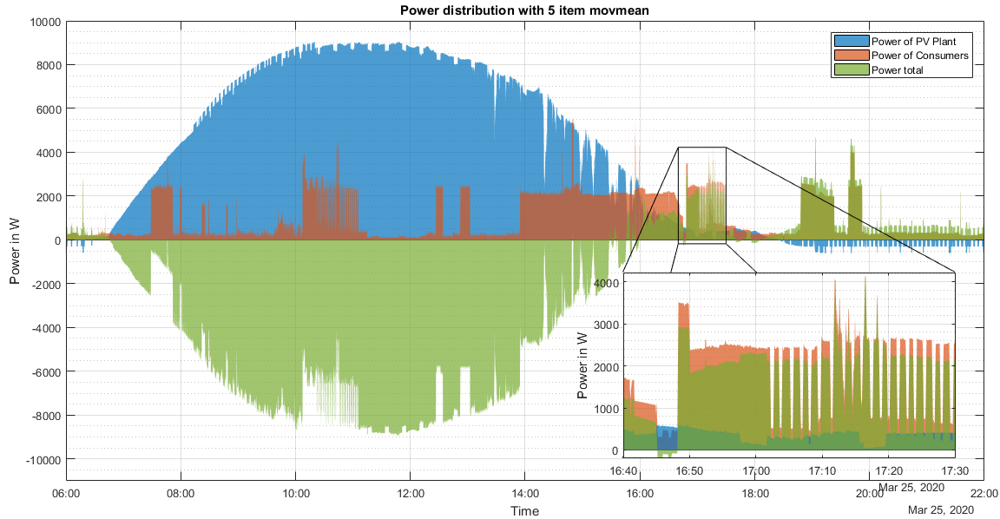

# SmartMeter Reader V2.0

This Project is a continuation of the first version available [here](https://github.com/VinFar/SML-Reader-STM32F0).

# Introduction
This Repo is about a system for reading out the upcoming electrical [SmartMeter](https://discovergy.com/blog/was-ist-ein-smart-meter). With this system it is possible to read out SmartMeter over the optical interface that is present on all meters. The system includes the following features:
- Reading out, storing and evaluating the data that is put out by the SmartMeter
  - Two SmartMeters can be read out simultaneously
  - Data can be stored on a built in storage and read out at any time over USB
  - An implementation for SD-Cards is in development
- Displaying the live data on a wireless display and storing some statistical informations
- Switching consumers like a water heater or consumers that can be switched easily
- Charging an EV with a power adapted to the current PV plant (if one exists)
- Scheduled switching of consumers
- Recognize consumers with a periodical consumption like a fridge and detect a failure of those (currently in development)
- Provide basic and useful informations to the over their consumption, such as the average base load or whether weekly consumption has increased/decreased

**The plot below shows a example of the Data that can be generated with this system.
 It shows three different plots:**
- The blue area is the electricity generated by a 10kW PV plant
- The orange area is the electricity used by the household
- The green area is the amount of electricity which is put into the grid

The interval for saving the data was set to two seconds and thus it is possible to detect different consumer, like a **bread baking machine** that is shown in the zoomed area.

# Hardware
The system consists of three different PCBs (or units as labeled in the development). The following list is a briefly description of these units:
- The [main unit](##MainUnit) responsible for reading the SmartMeter and acts as a Master for all other PCBs
- Two [read heads](##ReadHead) which are attached to the SmartMeters using a magnet and connected to the MainUnit over RJ11 Cables.
- An optional [display unit](##DisplayUnit) for displaying different informations like the current consumption, meter reading etc.
- An optional [consumer unit](##ConsumerUnit) used to switch consumers and charging an electric vehicle

All Units were developed using the same basis structure consisting of a STM32F0 MCU, EEPROM, RTC and a protected power supply. Different entities like a flash storage or relays were added to add the desired functions.
The advantage of this principle is that different functions like a LC display or external device can be easily replaced or added to each unit.
Click to show details

## Overview of the Hardware

## MCU
A STM32F091RCT6 MCU with 256kB Flash and 32kB RAM is the central entity of this PCB.
It receives and transmits data from other PCB over the NRF24 Transceiver with a defined protocol, to prevent wrong data transmission.
It also does the analog signal processing with its built-in comparators (MainUnit), controls the LC Display (DisplayUnit) and generates the desired outputs for external devices (ConsumerUnit)

## Power Supply
As with all PCBs this one also has several protection features (which is bit of an overkill), like reverse-, over- and undervoltage protection, as well as an overcurrent protection.
This PCB can be powered with 7V to 15V DC. To not trip the over- or undervoltage protection it is necessary to change the voltage divider values for the [eFuse](http://www.ti.com/lit/ds/symlink/tps2596.pdf).
As mentioned in different eletronic forums the NRF24 Wireless IC is said to be vulnerable to voltage drops on Vdd. To prevent this multiple bypass Capacitors (100µ, 10µ, 1µ) were placed directly on the Vdd and GND Plane around the Vdd Pin.

## RTC
To correctly store the SmartMeter data over time a RTC were added on all PCBs. The MainUnit additionally has a backup battery, to prevent loss of the timestamp in case of power failure. The DisplayUnit and the ConsumerUnit will periodically receive the current unix time over the NRF24.

## Housings
For all PCBs 3D printable housing with fitting lids were developed, to protect them from the environment:

Detailed description are available below:

# MainUnit
This Unit is the central unit of the entire system and is responsible for the following tasks:
- Reading out of up to two SmartMeters simultaneously
- Storing the data on an SD-Card (in development) or on a built-in 128MB flash storage
- Scheduling the consumers after a programmable method, time, priorities etc.
- Scheduling the charging of the EV
- Transmitting and receiving data to/from the Dislay- and ConsumerUnit

The Circuit, Layout and Gerber files can be found here.

## Analog ciruitry
The signal that is coming from the ReadHead is basically just the amplified output of the photodiode, that must be processed to get a reliable UART Signal, that can be directly detected by the internal UART Hardware. With this architecture the trigger voltage for the comparator can be taken from the DAC or Vref. With the DAC it is possible to automatically detect and adapt the correct trigger voltage in order to cover a wide variety of use cases. The analog circuit was developed to also make it possible to detect the rotating disc of old [Ferraris Meters](https://de.wikipedia.org/wiki/Ferraris-Z%C3%A4hler), due to the fact that these are used in old houses. ToDo: This has to be evaluated yet.

## Flash storage
A 128MB SPI-Flash was also implemented to store the incoming SmartMeter data and transmit it later to a Host-PC to plot the consumption over time. ToDo: NAND Flash was a bad choice, must be replaced by a SD-Card for the next version

## Connections
As mentioned above the PCBs has JST XH connecters (2.54mm spacing) for SWD, I²C and UART, all with power pins.
This was done to optionally add things like a segment/LC Display, external sensors etc.

# ReadHead
The ReadHead is small round "dongle" (32mm diameter) which sits on the metal plate of the SmartMeter. It consists of two PCBs which are stacked together with SMD Pin Headers.

 
 

## Overview
The bottom PCB holds a photodiode to detect the transmitted IR impulses form the SmartMeter and also a IR-LED to transmit data to the SmartMeter(which is possible in some cases). The top PCBs holds the RJ11 Connector and some active components like a transimpedance amplifier for the photodiode or a adjustable current source for the IR-LED. The ReadHead basically just send the amplified photodiode output to the MainUnit.

## Compatibility for Ferraris Meters
The photodiode in combination with the current source and the IR-LED it should be possible to also detect the rotating disc on old [Ferraris Meters](https://de.wikipedia.org/wiki/Ferraris-Z%C3%A4hler). The current source can adjusted over the DAC of the MCU and thus the current through the IR LED between 0mA and 70mA. With this the amount of light radiated by the LED ist adjustable and can be modulated to supress background noise. A proof of concept (without the current source and modulation) was done [here](https://www.kompf.de/tech/emeir.html). Todo: This has to be evaluated yet.

## Housing
The CAD drawing below shows the current version of the PCB with a 3D printed housing: 

The Circuit, Layout and Gerber files can be found here.

# DisplayUnit
The DisplayUnit is optional, but very usefel and displayes different informations and values of the current consumption on a 20x4 LC display. It can also be used to change and set different parameters of the system like the time for the mean value calculation or if the SmartMeter data is stored or not.
It has an EEPROM connected where minimum and maximum values or the mean consumption over the last days/weeks can be saved.

**Note:** This unit may seem *oldschool* and not up-to-date, but this was a sytem that I could develop faster than a PCB with Wifi or a smartphone app etc... So I went with this and it works flawlessly.

 
 

## Powersupply
In contrast to the other PCBs this unit is battery powered and can be charged over a UCB-C Cable. The following features are implemented:
- Overcharge and overdischarge protection
- Charge managment
- LED Battery Indicator 
  
The over discharge protection can be adjusted over a voltage divider. Todo: There is a bug in the circuit for the overdischarge protection: D and S of the PMOS are reversed!

## Display
Currently a 20x4 LC display is used and is connected to the MCU over I²C and a IO Expander. Can be replaced by any other display that supports I²C or USART.

## Status LEDs
The DisplayUnit has a red and a green LED to display different states of the entire systems.

## Housing
A 3D printable housing was designed in which the entire PCB and a 18650 Li-Ion Battery will fit. This is the first version and is bit bulky with its dimensions. Another version will follow some time.

# ConsumerUnit
This unit is used to control the consumers and to charge the eletric vehicle over a Wallbox. It has to 10A Relays to directly switch on/off different simple consumers like a water heater. This unit can control the charging power of a EV by connecting it to a Wallbox that accepts one of the following control signal:
- 5V PWM signal
- 0 - 20mA current signal
- 4 - 20mA current signal
- 0 - 10V voltage signal

It is also possible to measure and monitor the current of the connected device over a halleffect IC and to characterize the device.

Together with a [EVSE](https://www.evalbo.de/shop/ladetechnik/) a complete Wallbox can be built and wirelessly connected to the the MainUnit. This setup is able to charge the EV matched with the current available PV Power.

 
 
## Outputs
There are several outputs for external devices availabl (mentionded above), to control a variety of devices like EV Wallboxes or external thyristor controller to control the power consumption of a e.g. Water heater
 Todo: Implemented a thyristor controller directly on the PCB

## Relays
Two 230V 10A switching relays are placed on the PCB (electrically isolated) to switch on or off different simple consumer like a water heater or air heater.

## Current measurement
Each 230V Output has a hall effect IC in series to measure the flowing current in order to measure the power the device is consuming (with a programmable fixed voltage). With this information it is possible to schedule these consumer better.

# Software

The firmware for the system is divided in three parts for the three PCBs:

- Branch [SMU-Main](https://github.com/VinFar/SML_Reader_V2.0/tree/SMU-Main) for the MainUnit
- Branch [Display-Unit](https://github.com/VinFar/SML_Reader_V2.0/tree/Display-Unit) for the DisplayUnit
- Branch [Wireless-Unit](https://github.com/VinFar/SML_Reader_V2.0/tree/Wireless-Unit) for the ConsumerUnit

**A detailed description will follow**
